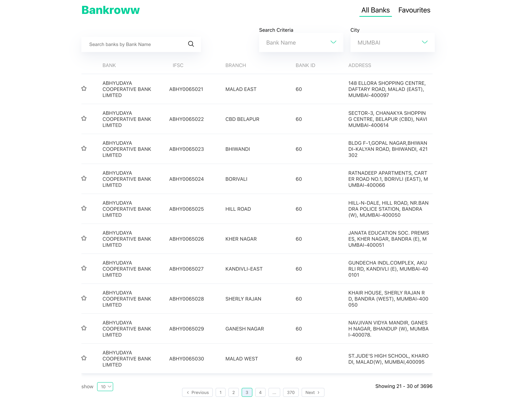

# Hi👋, this is Bankroww

`One place to find all banks in your city`

  
  

## Why Bankroww?

Bankroww is created as an assignment. It is created with CRA and is completely responsive as well. You can access the website at the given link in the description as well.

## What all features we have?

<ul>
<li>Add/Remove banks to your favourites</li>
<li>Pagination for better table UX</li>
<li>Search and Filter Options</li>
</ul>

## Want to run locally?

I am using CRA for this repo, clone this code by using:
`git clone https://github.com/shuvamk/bankroww.git`
then go to directory:
`cd bankroww`
install npm packages:
`npm i`
run the server:
`npm start`
The project will be (in most caes)started on localhost:3000
